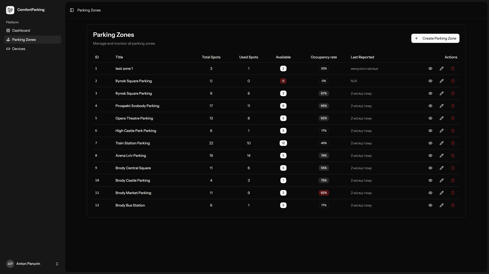
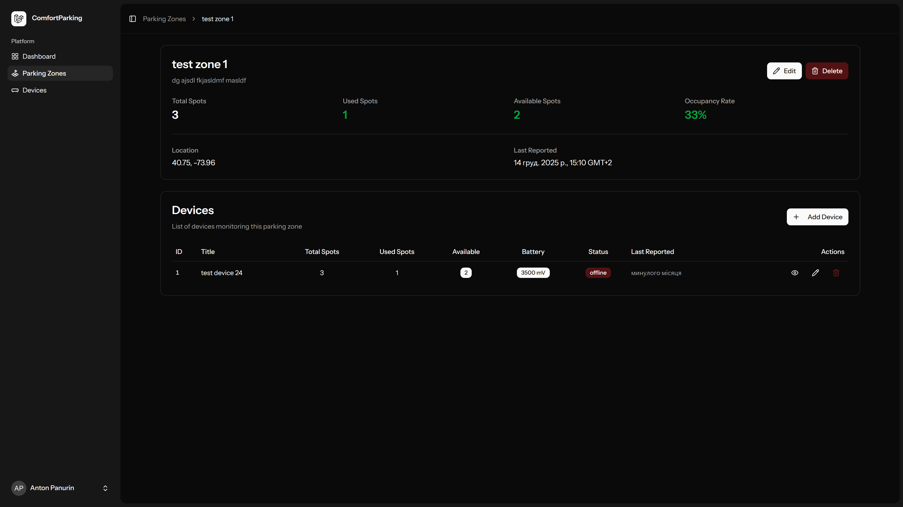
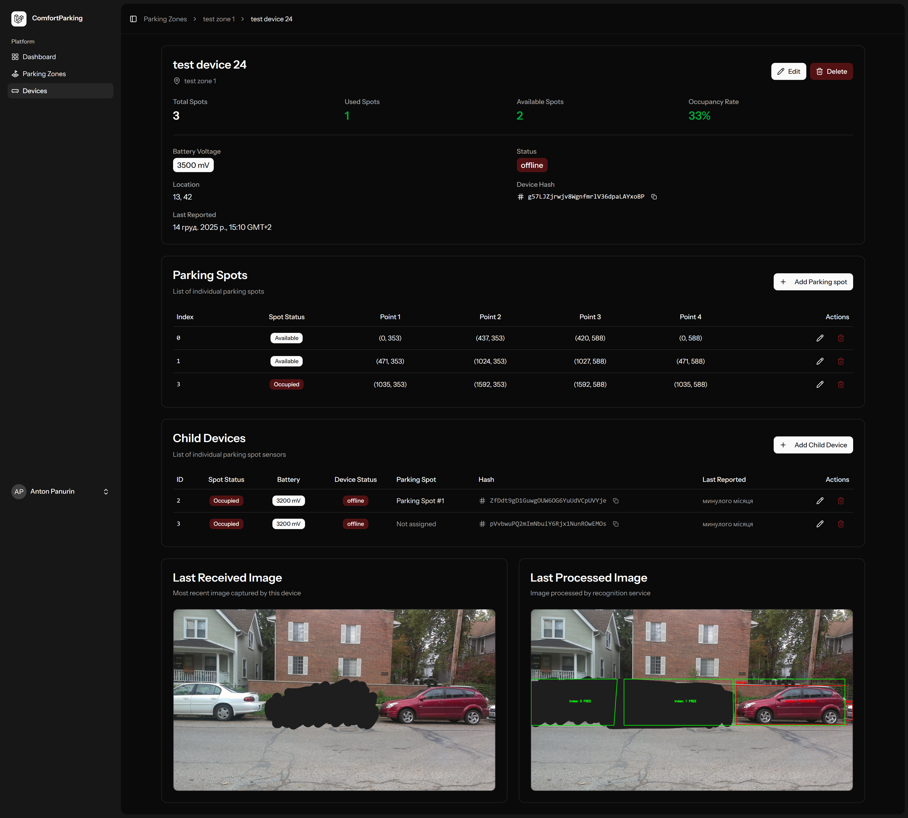

# 🅿️ ComfortParking

A modern, full-stack smart parking management solution that combines IoT devices with AI-powered image recognition to provide real-time parking spot availability monitoring.


> 🎓 **This is a Proof of Concept (PoC) project developed for university purposes.**

---

## 📱 Related Projects

| Project | Description |
|---------|-------------|
| [ComfortParking Mobile App](https://github.com/Tommy4chan/ComfortParking-Mobile) | React Native mobile application for end-users to find available parking spots |

---

## 📸 Screenshots

### Dashboard

*Main dashboard showing parking zones overview*

### Parking Zones Management

*Manage and monitor parking zones with real-time availability*

### Device Management

*IoT device configuration and monitoring interface*


---

## 🎯 What is this?

This ComfortParking is designed to monitor and manage parking infrastructure using a combination of:

- **IoT Camera Devices** - Capture images of parking areas
- **AI Image Recognition** - Analyze images to detect vehicle occupancy
- **Child Sensor Devices** - Ground-based sensors for additional accuracy
- **Real-time API** - Geospatial queries for nearby parking availability

The system is ideal for:
- 🏢 Commercial parking lots
- 🏙️ Municipal parking management
- 🏬 Shopping center parking
- 🏭 Industrial facility parking

> 📱 **A companion React Native mobile app** is available for end-users to find and navigate to available parking spots in real-time.

---

## ✨ Main Features

### 🗺️ Geospatial Parking Zone Management
- Create and manage parking zones with precise GPS coordinates
- PostGIS-powered spatial queries for finding nearby parking
- Bounding box queries for map-based applications
- Real-time statistics on available/used spots per zone

### 📡 IoT Device Integration
- Register and manage camera devices per parking zone
- Support for child sensor devices attached to individual spots
- Battery voltage monitoring and device status tracking
- Secure device authentication via unique hash identifiers

### 🤖 AI-Powered Image Recognition
- Integration with external image recognition API
- Automatic parking spot occupancy detection from camera images
- Polygon mask configuration for precise spot detection
- Processed image storage with visual overlay results

### 📊 Real-time Monitoring
- Live parking availability dashboard
- Device health monitoring (battery, last report time)
- Status indicators (online/offline/warning)
- Historical data tracking

### 🔐 Secure API
- RESTful API for device synchronization
- Webhook support for image recognition results
- HMAC signature verification for secure communications
- Laravel Fortify authentication with 2FA support

### 🖥️ Modern Admin Panel
- Responsive React-based admin interface
- Full CRUD operations for all entities
- Interactive parking spot mask editor
- Real-time updates with Inertia.js

---

## 🛠️ Tech Stack

### Backend
| Technology | Version | Purpose |
|------------|---------|---------|
| **PHP** | 8.4 | Runtime environment |
| **Laravel** | 12.x | Backend framework |
| **PostgreSQL** | + PostGIS | Database with geospatial support |
| **Laravel Fortify** | 1.30 | Authentication & 2FA |
| **Laravel Magellan** | 2.0 | PostGIS integration |
| **Queue Workers** | - | Background job processing |

### Frontend
| Technology | Version | Purpose |
|------------|---------|---------|
| **React** | 19.x | UI framework |
| **TypeScript** | 5.7 | Type-safe JavaScript |
| **Inertia.js** | 2.x | SPA without API complexity |
| **Tailwind CSS** | 4.x | Utility-first styling |
| **Radix UI** | - | Accessible UI components |
| **Lucide Icons** | - | Icon library |
| **Vite** | 7.x | Build tool |

### Infrastructure
| Technology | Purpose |
|------------|---------|
| **Docker** | Containerization |
| **Nginx** | Web server / Reverse proxy |
| **Node.js** | 24 LTS - Frontend build |

---

## 📁 Project Structure

```
├── app/
│   ├── Http/
│   │   ├── Controllers/          # Web & API controllers
│   │   │   └── Api/V1/           # Versioned API endpoints
│   │   ├── Middleware/           # Custom middleware
│   │   └── Requests/             # Form request validation
│   ├── Jobs/                     # Queue jobs (image processing)
│   ├── Models/                   # Eloquent models
│   │   ├── ParkingZone.php       # Parking zone with geolocation
│   │   ├── Device.php            # IoT camera devices
│   │   ├── ChildDevice.php       # Ground sensors
│   │   └── ParkingSpot.php       # Individual parking spots
│   ├── Services/                 # Business logic services
│   │   └── ImageRecognitionService.php
│   └── Utils/                    # Helper utilities
├── resources/
│   └── js/
│       └── pages/                # React page components
│           ├── parkingZones/     # Zone management UI
│           ├── devices/          # Device management UI
│           ├── parkingSpots/     # Spot configuration UI
│           └── dashboard.tsx     # Main dashboard
├── routes/
│   ├── api.php                   # API routes
│   └── web.php                   # Web routes
├── database/
│   └── migrations/               # Database schema
├── docker-compose.yml            # Docker orchestration
└── Dockerfile                    # Container definition
```

---

## 🚀 Getting Started

### Prerequisites

- PHP 8.2+
- Composer
- Node.js 20+
- PostgreSQL with PostGIS extension
- Docker (optional)

### Installation

1. **Clone the repository**
   ```bash
   git clone https://github.com/Tommy4chan/ComfortParking-Web.git
   cd ComfortParking-Web
   ```

2. **Install dependencies**
   ```bash
   composer install
   npm install
   ```

3. **Environment setup**
   ```bash
   cp .env.example .env
   php artisan key:generate
   ```

4. **Configure database**
   
   Update `.env` with your PostgreSQL credentials:
   ```env
   DB_CONNECTION=pgsql
   DB_HOST=127.0.0.1
   DB_PORT=5432
   DB_DATABASE=parking
   DB_USERNAME=your_username
   DB_PASSWORD=your_password
   ```

5. **Run migrations**
   ```bash
   php artisan migrate
   ```

6. **Build frontend assets**
   ```bash
   npm run build
   ```

7. **Start development server**
   ```bash
   composer dev
   ```
   This starts the PHP server, queue worker, and Vite dev server concurrently.

### Docker Setup

```bash
docker-compose up -d
```

This will start:
- PHP-FPM application container
- Queue worker container
- Nginx web server (port 7070)

---

## 🔌 API Endpoints

### Public API (v1)

| Method | Endpoint | Description |
|--------|----------|-------------|
| `GET` | `/api/v1/zones/in-bounds` | Get zones within map viewport |
| `GET` | `/api/v1/zones/nearby` | Get zones near coordinates |
| `POST` | `/api/v1/devices/sync` | Sync device data & upload image |
| `POST` | `/api/v1/webhooks/image-recognition` | Receive AI recognition results |

### Zone Queries

**Get zones in bounds:**
```bash
GET /api/v1/zones/in-bounds?min_lat=51.0&max_lat=52.0&min_lng=17.0&max_lng=18.0
```

**Get nearby zones:**
```bash
GET /api/v1/zones/nearby?lat=51.1&lng=17.0&radius=5000
```

---

## ⚙️ Configuration

### Image Recognition Service

Configure in `.env`:
```env
IMAGE_RECOGNITION_API_URL=https://your-ai-service.com/analyze
IMAGE_RECOGNITION_API_SECRET=your_secret_key
IMAGE_RECOGNITION_TIMEOUT=30
IMAGE_RECOGNITION_SIGNATURE_HEADER=X-Signature
```

### Queue Configuration

The system uses Laravel queues for processing image recognition jobs. Configure your preferred queue driver:

```env
QUEUE_CONNECTION=database  # or redis, sqs, etc.
```

---

## 📐 Data Models

### Parking Zone
- `title` - Zone name
- `description` - Optional description
- `location` - PostGIS Point (lat/lng)
- Computed: `total_spots`, `used_spots`, `available_spots`

### Device (Camera)
- `title` - Device name
- `location` - PostGIS Point
- `battery_voltage` - Battery level in mV
- `hash` - Unique device identifier
- `last_reported_at` - Last sync timestamp
- `last_image_path` - Latest captured image
- `last_processed_image_path` - AI-processed image

### Parking Spot
- `device_id` - Parent device
- `is_used` - Occupancy status
- `index` - Spot number
- `point_1-4_x/y` - Polygon mask coordinates

### Child Device (Sensor)
- `device_id` - Parent camera device
- `parking_spot_id` - Associated spot
- `is_spot_used` - Sensor reading
- `battery_voltage` - Battery level
- `hash` - Unique identifier

---

## 🧪 Testing

```bash
# Run all tests
php artisan test

# Run with coverage
php artisan test --coverage
```

---

## 📝 License

This project is licensed under the MIT License - see the [LICENSE](LICENSE) file for details.

---

## 🤝 Contributing

Contributions are welcome! Please feel free to submit a Pull Request.

1. Fork the project
2. Create your feature branch (`git checkout -b feature/AmazingFeature`)
3. Commit your changes (`git commit -m 'Add some AmazingFeature'`)
4. Push to the branch (`git push origin feature/AmazingFeature`)
5. Open a Pull Request

---

## 📧 Contact

For questions or support, please open an issue in the repository.

---

<p align="center">
  Made with ❤️ using Laravel & React
</p>
